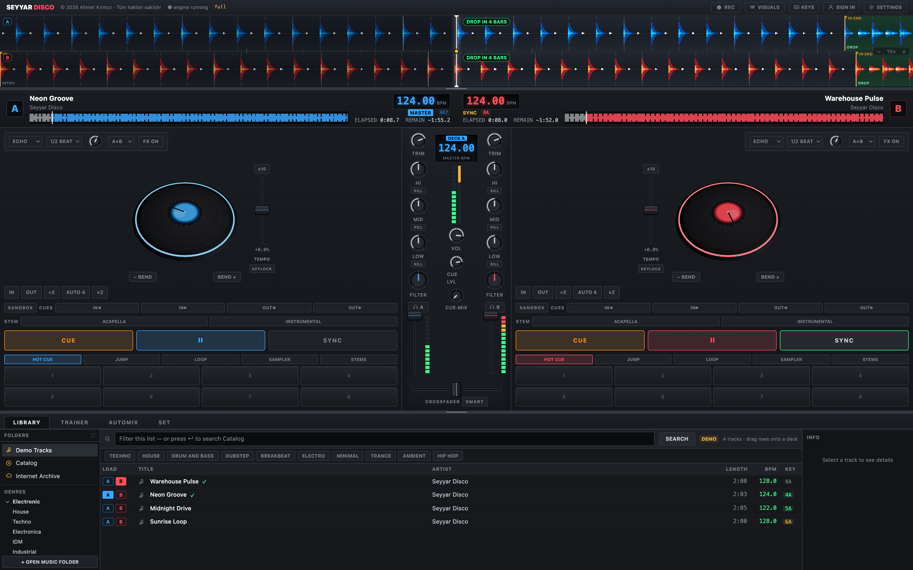
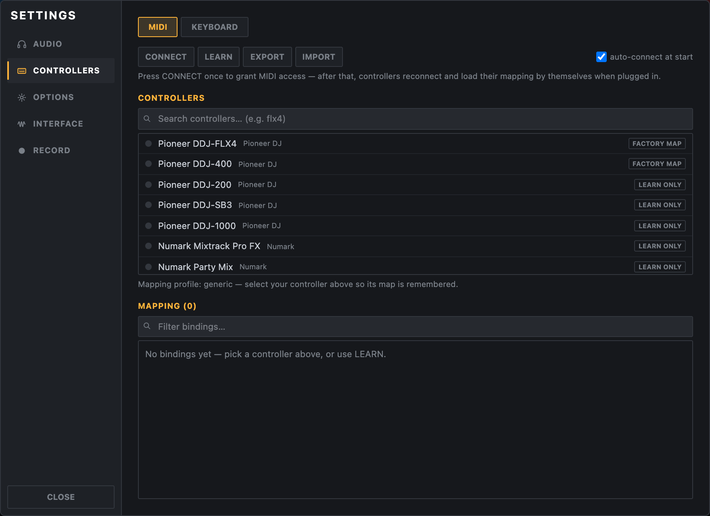
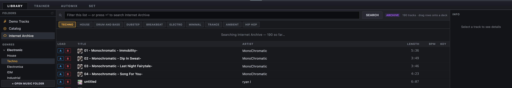

  

<h1 align="center">Seyyar Disco for desktop</h1>

  A two-deck DJ mixer for learning to mix, now as a native macOS and Windows app. 
  Same engine as <a href="https://www.seyyardisco.com">seyyardisco.com</a>, without the browser in the way.

  
  

## Download

| Platform | Download | Notes |
|---|---|---|
| macOS, Apple silicon (M1 and later) | [SeyyarDisco-mac-arm64.dmg](https://github.com/Ahmet-Kirmizi/seyyar-disco-releases/releases/latest/download/SeyyarDisco-mac-arm64.dmg) | macOS 12 or newer |
| macOS, Intel | [SeyyarDisco-mac-x64.dmg](https://github.com/Ahmet-Kirmizi/seyyar-disco-releases/releases/latest/download/SeyyarDisco-mac-x64.dmg) | macOS 12 or newer |
| Windows, 64-bit | [SeyyarDisco-win-x64.exe](https://github.com/Ahmet-Kirmizi/seyyar-disco-releases/releases/latest/download/SeyyarDisco-win-x64.exe) | Windows 10 or newer |

Not sure which Mac you have? Open the Apple menu, choose *About This Mac*: "Apple M…" means Apple silicon, "Intel" means Intel.

All builds are also listed on the [Releases](https://github.com/Ahmet-Kirmizi/seyyar-disco-releases/releases) page.

## Installing

**macOS.** Open the `.dmg` and drag *Seyyar Disco* into *Applications*. The app is not yet
notarized, so the first launch needs one extra step: right-click (or Control-click) the app in
*Applications* and choose **Open**, then confirm. After that it opens normally.

**Windows.** Run the installer. SmartScreen may show "Windows protected your PC" because the
build is not yet code-signed: click **More info**, then **Run anyway**.

Your account, plan and cloud library are the same as on the web. Sign in once and you are in.

## Why the desktop app

- **MIDI controllers just work.** Fifteen built-in profiles with auto-connect and sysex LED feedback,
  no browser permission prompts, and *learn* for anything else.
- **Headphone pre-cue.** Route the cue bus to a second audio device for real beatmatching.
- **Your music folder as a tree.** Point it at a folder once; it stays there across launches.
- **No sleep mid-set.** The display stays awake while a deck is playing.
- **A window that is yours.** No tabs, no tab throttling, no accidental back-navigation.

  
  

## What is inside

- Two decks with frequency-colored waveforms, a beat grid you can trust, and a vinyl platter you can grab.
- Full-kill EQ, one-knob filter, equal-power crossfader; echo, reverb and filter sweep locked to the beat.
- Eight pads with four modes: hot cues, loops at any speed, loop roll, slip mode and a sampler.
- Keylock, sync, quantize, and an automix that narrates every move it makes.
- Set review: record a set, get your transitions marked and scored.
- Music from three places: your folders, millions of Creative Commons tracks from the Internet Archive, and your cloud library.
- Four skins, four languages (English, Türkçe, Русский, Español), a 24-bit WAV recorder on the master bus.
- A Strudel live-coding drawer for patterns that land straight on a deck.

## Updating

Download the newest installer from the table above and install it over the existing app.
Automatic updates arrive with the signed builds.

## About this repository

It holds only installers. The application source is private. Questions and bug reports:
[seyyardisco.com](https://www.seyyardisco.com).

© 2026 Ahmet Kırmızı. All rights reserved.
